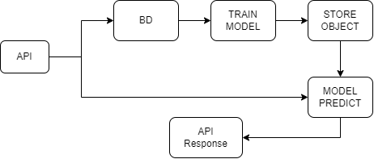

# Bike Rentals Prediction
Projeto inspirado no bootcamp Microsoft Azure AI Fundamentals da DIO, que consiste na criação de um modelo de predição de aluguel de bicicletas e na disponibilização do mesmo através de uma API

DIO: https://www.dio.me/ 

### Estrutura do projeto:
1. **API para Ingestão e Predição dos Dados:**
   - Uma API com um endpoint para receber e armazenar dados de transações em um banco de dados.
   - Outro endpoint para realizar a predição dos valores de aluguel com base nos dados fornecidos

2. **Pipeline de Treinamento do Modelo:**
   - Um pipeline que treina o modelo de previsão de aluguel de bicicletas e salva o objeto do modelo treinado para uso posterior.

### Rascunho da Arquitetura:
